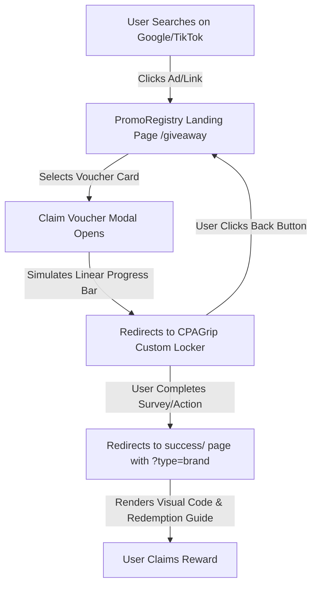

# 📂 PromoRegistry & Affiliate System Playbook (Project Memory)

This document serves as a comprehensive system memory and playbook for **PromoRegistry**. Any future developer, agent, or owner can read this playbook to understand the codebase structure, deployed pages, custom scripts, CPAGrip configurations, and Google Ads setups from A to Z.

---

## 1. Project Overview & Architecture

**PromoRegistry** (`https://www.promoregistry.com`) is a premium discount, promo registry, and giveaway landing portal. We have built an optimized, high-converting gateway designed to drive organic and paid traffic to CPA/CPL offers and deliver digital vouchers.

### 🔄 The User Journey Flow (Mermaid Diagram)



---

## 2. Deployed Files & Codebase Structure

The project code is built in **Next.js 14+ (App Router)** and located in the directory:
`C:\Users\Supreme_Traders\.gemini\antigravity\scratch\all_repos\my-coupon`

### 💻 Core Frontend Pages
*   **Giveaway Main Hub:** [page.tsx](file:///C:/Users/Supreme_Traders/.gemini/antigravity/scratch/all_repos/my-coupon/src/app/giveaway/page.tsx)
    *   *Features:* Renders 8 reward cards (Walmart, Shell, PayPal, Roblox, Steam, Amazon, PlayStation, Google Play) using custom inline high-fidelity SVGs.
    *   *BFCache Handler:* Injected a `pageshow` transition window listener that detects if `event.persisted` is true (navigating back from CPAGrip) and automatically clears the loading state to restore the main giveaway hub.
    *   *Loader:* Features a smooth 1.2-second linear progress bar inside the claim modal instead of technical logs.
*   **Success Redemption Gateway:** [page.tsx](file:///C:/Users/Supreme_Traders/.gemini/antigravity/scratch/all_repos/my-coupon/src/app/giveaway/success/page.tsx)
    *   *Features:* Accepts `?type=` query parameters (e.g. `walmart`, `steam`, `robux`) and dynamically reveals brand-colored digital vouchers, codes, and redemption instructions. Includes a safe file-download bar.

### ⚙️ Automation & API Import Scripts
*   **Campaign Upload Script:** [create_multiple_campaigns_rest.js](file:///C:/Users/Supreme_Traders/.gemini/antigravity/scratch/all_repos/my-coupon/scripts/create_multiple_campaigns_rest.js)
    *   *Features:* Uses Node.js HTTPS modules to call the Google Ads API **v25** REST interface. It loads credentials from `.env.production` or `.env.local` to import campaigns in a **PAUSED** state.
*   **Campaign Configurations CSV:** [giveaway_campaigns_ready.csv](file:///C:/Users/Supreme_Traders/.gemini/antigravity/scratch/all_repos/my-coupon/giveaway_campaigns_ready.csv)
    *   *Features:* Contains structural configurations for **Walmart**, **Roblox**, and **Steam** Search campaigns (Target: UK, Language: English, Daily Budget: 1,500 PKR, Paused). Alignments follow Google Ads policy regulations (e.g. descriptions under 90 characters).

---

## 3. CPAGrip Custom CSS Template

To bypass CPAGrip's default design limitations and text contrast bugs, apply the custom CSS template below in the **CPAGrip Content Locker Dashboard -> CSS Tab**. 

*   **Design Tokens:** Deep Navy Slate (`#0f172a` - Slate 900) buttons with bold white text (`font-weight: 800`). Smooth hover shift to bright Royal Blue (`#2563eb`).
*   **Contrast Bug Fix:** Uses `background-image: none !important` and `background: #0f172a !important` to override default CPAGrip gradient layers that cause white-on-white text readability issues.

```css
/* CPAGRIP CUSTOM OVERRIDES */
@import url('https://fonts.googleapis.com/css2?family=Outfit:wght@400;600;700;800&display=swap');

body {
	background: #f8fafc url(/assets/images/simple-human-bg.jpg) no-repeat center center fixed !important;
	background-size: cover !important;
	font-family: 'Outfit', sans-serif !important;
	padding: 20px !important;
	display: flex !important;
	align-items: center !important;
	justify-content: center !important;
	min-height: 100vh !important;
	box-sizing: border-box !important;
}

.display, .locker-box {
	background-color: #ffffff !important;
	border: 1px solid #e2e8f0 !important;
	border-radius: 16px !important;
	padding: 45px !important;
	width: 100% !important;
	max-width: 460px !important;
	box-shadow: 0 10px 15px -3px rgba(30, 27, 75, 0.04) !important;
	text-align: center !important;
}

.locker-title {
	font-size: 1.75rem !important;
	font-weight: 800 !important;
	color: #1e1b4b !important;
	margin-bottom: 10px !important;
}

.locker-desc {
	font-size: 1.05rem !important;
	color: #475569 !important;
	line-height: 1.5 !important;
	margin-bottom: 28px !important;
}

.offers-wrapper a, .offers-wrapper .offer_link, .link_a, .dl_button {
	display: block !important;
	background: #0f172a !important; /* Slate 900 */
	background-image: none !important;
	color: #ffffff !important;
	font-size: 1.15rem !important;
	font-weight: 800 !important;
	padding: 16px 24px !important;
	margin-bottom: 14px !important;
	border-radius: 12px !important;
	border: 1px solid rgba(255, 255, 255, 0.1) !important;
	box-shadow: 0 4px 10px rgba(15, 23, 42, 0.15) !important;
	text-align: center !important;
	width: 100% !important;
	box-sizing: border-box !important;
	transition: all 0.2s cubic-bezier(0.34, 1.56, 0.64, 1) !important;
}

.offers-wrapper a:hover, .offers-wrapper .offer_link:hover, .link_a:hover {
	background: #2563eb !important; /* Royal Blue */
	background-image: none !important;
	transform: translateY(-2px) !important;
	box-shadow: 0 6px 15px rgba(37, 99, 235, 0.25) !important;
}
```

---

## 4. Google Ads & Keywords Planner Insights

We have mapped the following Google Keyword volume and CPC stats for low-cost PPC arbitrage targeting:
*   **Walmart Free Cards:** Volume: 10K - 100K | High bid: $0.15 - $0.35
*   **Free Robux Codes:** Volume: 50K - 150K | High bid: $0.10 - $0.22
*   **Steam Wallet Giveaway:** Volume: 5K - 50K | High bid: $0.12 - $0.30

*Targeting Strategy:* Set campaigns targeting `United Kingdom` and `United States` on phrase match or exact keywords in the `giveaway_campaigns_ready.csv` file.

---

## 5. Setup & Payment Profiles

*   **Wise Payout Account:** Name: `Atif Zaheer` (sort code: `230801`, account: `12079627`).
*   **Network Applications:**
    *   *MaxBounty Application:* Submitted under email `methewdippy@gmail.com`. Intended promotional method set to Google Search Ads PPC with a testing budget of $500 - $1,000.
    *   *Aragon Application:* Submitted under company name `PromoRegistry`. Setup Skype display name as `PromoRegistry` to match application logs. Proactive check-up email sent to `publishers@aragon-advertising.com`.

---

## 6. Playbook for Organic Free Traffic

For immediate, zero-budget conversion testing:
1.  **TikTok / Shorts:** Post 7-15 second screen recordings showing user navigating PromoRegistry giveaway card loader, then getting redirected. Overlay trending sound and write: *"Legit free $100 Walmart card in 2 mins. link in profile!"*
2.  **Pinterest Pins:** Generate Canva pins for "How to get free gift cards legally" redirecting to `https://www.promoregistry.com/giveaway`.
3.  **Discord/Reddit:** Participate in Roblox/freebie groups and share the PromoRegistry link when people query about cards.

---

## 7. Vercel Deployment (IMPORTANT — READ THIS FIRST)

⚠️ **GitHub repo is PRIVATE.** Vercel Hobby (free) plan does NOT auto-deploy private repos via Git integration — it asks for a paid Pro subscription. **DO NOT try to fix this by making the repo public or paying.**

### ✅ Free Deployment Method: Vercel CLI Direct Deploy

Instead of relying on Git push → Vercel auto-deploy, use the **Vercel CLI** to upload and deploy files directly from the local machine. This bypasses the private repo restriction entirely.

**Step-by-step for agents:**

1.  **Check if Vercel CLI is logged in:**
    ```bash
    npx.cmd vercel whoami
    ```
    If not logged in, run `npx.cmd vercel whoami` — it will print a device flow URL like:
    `Visit https://vercel.com/oauth/device?user_code=XXXX-XXXX`
    Ask the user to visit that URL in their browser and click "Authorize".

2.  **Ensure the project is linked** (only needed once per clone):
    ```bash
    npx.cmd vercel link --yes --project my-coupon
    ```
    Run this from the **project root** directory: `C:\Users\Supreme_Traders\.gemini\antigravity\scratch\all_repos\my-coupon`
    (NOT from `frontend/` — the Vercel project setting has `frontend` as root directory, so it auto-appends it.)

3.  **Deploy to production:**
    ```bash
    npx.cmd vercel deploy --prod --yes
    ```
    Run from the **project root** directory. This uploads, builds, and deploys to production in ~2-3 minutes.

4.  **After deploy, push to GitHub for version control:**
    ```bash
    git add -A && git commit -m "feat: description" && git push origin main
    ```

### 🔑 Credentials
*   **Vercel Account Email:** `razaraghib549@gmail.com`
*   **Vercel Username:** `razaraghib549-1754`
*   **Vercel Team/Scope:** `hazique-s-projects`
*   **Vercel Project:** `my-coupon` (root directory set to `frontend`)
*   **GitHub Repo:** `https://github.com/n1007Inbo/my-coupon.git` (PRIVATE)
*   **Git Author Config:** `Methew Dippy <methewdippy@gmail.com>`

### ⚠️ Rules
*   **DO NOT** make the repo public to fix deployment — use CLI deploy.
*   **DO NOT** delete existing pages, stores, or data.
*   **DO NOT** generate AI images for logos — use text-based fallback initials or download from competitor sites.
